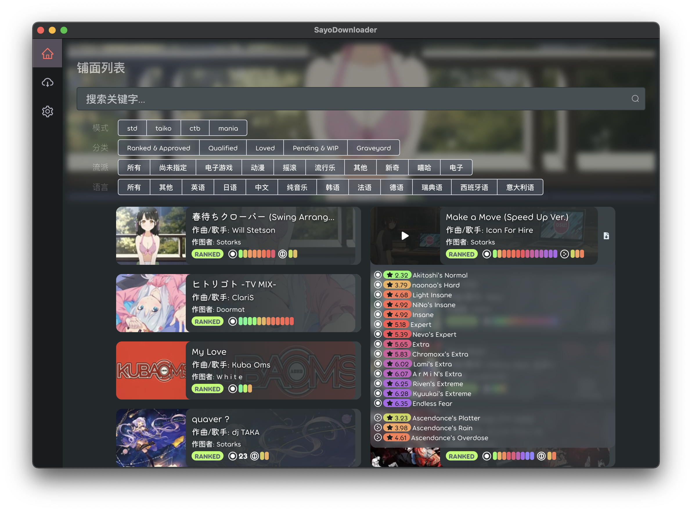
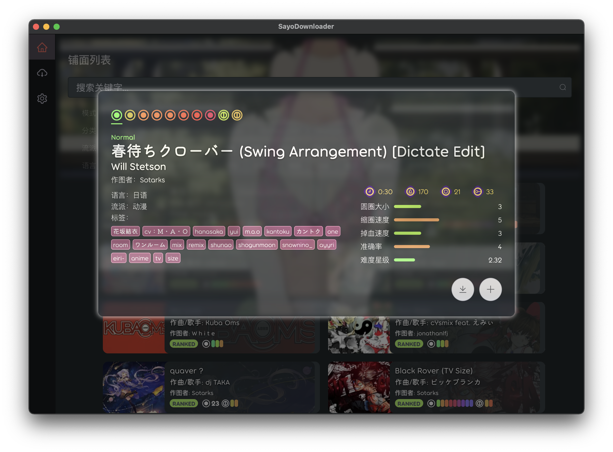
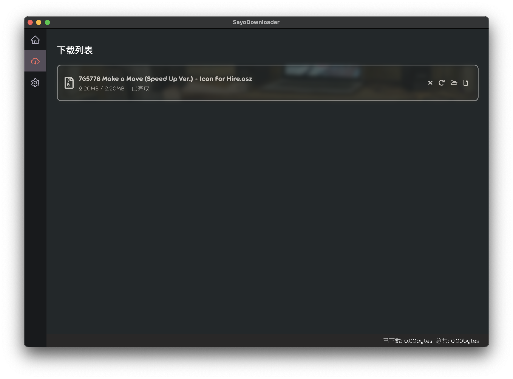

# SayoDownloader

***This software only provide in Chinese!***

一个全新设计的小夜地图下载器。

## 截图

## 功能

* 搜索和查看beatmap信息
* beatmap下载管理器
* beatmap的歌曲播放器
* 一些简单的设置

## 下载/使用方法

* 前往[Release](https://github.com/ChingCdesu/SayoDownloader/releases)页面，找到最新版，在Assets下拉菜单中找到适配你电脑的版本（Windows/Mac），单击即可下载
* 下载完成后解压压缩包
  * Windows用户找到SayoDownloader.exe双击打开即可
  * Mac用户将解压缩之后的App双击打开即可，建议移动到应用程序文件夹

## 注意事项

* SayoDownloader目前为预发布版本，在使用过程中可能遇到一些小问题，可以直接联系qq或者提出issue
